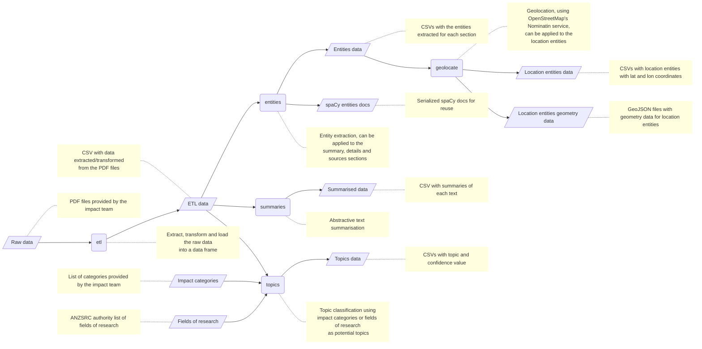

# REF Impact Data Analysis

For the list of changes to the project see the [Changelog](CHANGELOG.md).

## Workflow

The nodes with round edges represent actions available as commands via the [cli](#run-the-cli).

## Set up

Install [poetry](https://python-poetry.org/docs/#installation) and the requirements:

    poetry install

## Run the cli

    poetry run python cli.py

## Run the gui

    poetry run streamlit run streamlit_app.py

## Development

    poetry install --dev
    poetry shell
