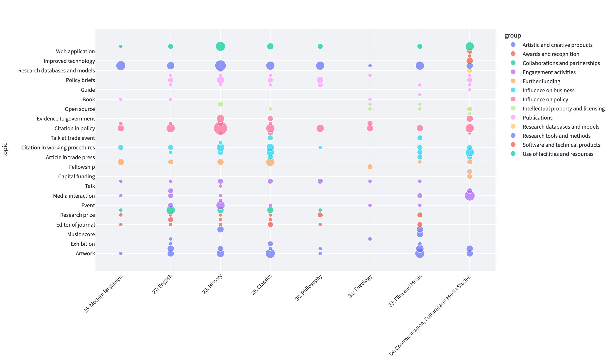

# REF 2021 impact data analysis

For the list of changes to the project see the [Changelog](CHANGELOG.md).

The REF 2021 Impact Data Analysis was a small project, between
[King's Digital Lab (KDL)](https://kdl.kcl.ac.uk/) and members of the
[King's College London (KCL)](https://kcl.ac.uk/) Research Management & Innovation Directorate, to produce analytical
work of the college's [REF 2021](https://results2021.ref.ac.uk/) impact case studies and
environment statements.

The data includes 158 impact case studies and environment statements, in PDF
(5-10 pages of text each), which follow standard templates but are expressed
with heterogenous descriptions and language.

The project was set up to help the impact team's address the questions:

> - What are the main types of impact KCL has delivered? Which pathways have been used
>   to deliver those impacts?
> - Who are our key partners and beneficiaries of our impacts?
> - Where are they - local (London), National or Global?
> - Is there a correlation between discipline and types of impact or pathways to impact
>   used?
> - What are the areas identified as strengths, areas for development and future plans?

## Architecture

The project has two main components, a Python command line tool to do the data
processing and to run the machine learning processes, and a web-dashboard to present
the results of the data processing.

## Workflow

- The process starts with extracting data from relevant sections of the documents into
  a single CSV file, which is then used by the different machine learning processes;
- [Zero shot](https://en.wikipedia.org/wiki/Zero-shot_learning) topic classification
  is applied to extract impact categories, fields of research and impact pathways's outputs;
- A [transformers](<https://en.wikipedia.org/wiki/Transformer_(machine_learning_model)>)-based
  language model is used to extract entities (mainly organisations and locations) from
  the data. The location data is further enriched by applying geocoding to gather
  coordinates and place geometries;
- Abstractive text summarisation is used to create summaries of the documents;
- And an indexing process indexes all the text both to perform keyword and semantic
  searches.

### About topic classification

Topic classification has been applied to the documents using different authority lists
to classify the data according to different perspectives:

- **Impact categories**, extracted from the whole text of the document based on the nine
  REF-defined areas of impact;
- **Fields of research (FoR)**, extracted from the section _Underpinning research_ based on the
  [Australian and New Zealand Standard Research Classification FoR classification](https://www.abs.gov.au/statistics/classifications/australian-and-new-zealand-standard-research-classification-anzsrc/latest-release#data-downloads);
- **Pathways' outputs**, extracted from the sections _Summary_, _Details of the impact_,
  based on the list of [outcomes/outputs](https://www.creds.ac.uk/how-to-prepare-a-pathways-to-impact-statement/)
  used by the impact data collection tool adopted by UKRI [Researchfish](https://researchfish.com/).

### About entity extraction

Entity extraction has been applied to different sections of the case studies to extract
mentions of Organisations, Places and Products.

- GPE: Geo-political entities, countries, cities, states
- LOC: Non-GPE locations, mountain ranges, bodies of water
- NORP: Nationalities or religious or political groups
- ORG: Companies, agencies, institutions, etc.
- PRODUCT: Objects, vehicles, foods, etc. (not services).

Entities extracted from the sections _Summary_, _Sources to corroborate the impact_ are
grouped together in the **Partners** view. Entities extracted from the section
_Details of the impact_ appear in the **Beneficiaries** view.

#### About locations

Entity extraction has been applied to the documents to extract Places mentions (GPE, LOC).
The extracted entities were geocoded and classified according to the categories local
(to London), national (UK) and global (rest of the world).

### Technologies

The project uses the following Python packages:

- [Typer](https://typer.tiangolo.com/) - to build the command line interface
  application;
- [pandas](https://pandas.pydata.org/) - to load and manipulate the data;
- [txtai](https://neuml.github.io/txtai/) - a library to build AI applications, it is
  used to [extract text](https://neuml.github.io/txtai/pipeline/text/extractor/) from the
  PDF documents, for [topic classification](https://neuml.github.io/txtai/pipeline/text/labels/),
  for [abstractive text summarisation](https://neuml.github.io/txtai/pipeline/text/summary/),
  and for [semantic and lexical search](https://neuml.github.io/txtai/embeddings/).
- [spaCy](https://spacy.io/) - natural language processing library used for entity
  extraction;
- [GeoPy](https://geopy.readthedocs.io/) - to geolocate the extracted places using the
  OpenStreetMap [Nominatin](https://nominatim.org/) service;
- [Streamlit](https://streamlit.io/) - to build the dashboard;
- [Plotly](https://plotly.com/python/) - to create the charts and visualisations.

> **Info**: Due to time constraints most of these are set up with the default settings.

### Models

- [Topic classification model](https://huggingface.co/joeddav/bart-large-mnli-yahoo-answers)
- [Summarisation model](https://huggingface.co/sshleifer/distilbart-cnn-12-6)
- [Entity extraction](https://spacy.io/models/en#en_core_web_trf)
- [Semantic search](https://huggingface.co/sentence-transformers/paraphrase-MiniLM-L3-v2)

## Dashboard

The results of the machine learning processes can be explored and visualised via a
[web-based dashboard](docs/dashboard.png). Via the dashboard it is also possible to
search and filter the data to get more specific insights, either for single or multiple
documents at the same time.
The [landing page](docs/dashboard.png) of the dashboard displays a table with all the
data and also overview information about the data.

### Impact categories

Visualisation displaying the output of topic classification to extract impact categories
(topic) and their connections to the documents unit of assessment (uoa).

### Pathways' outputs

Pathways' outputs are the pathways or outputs created by the researchers to achieve
impact.

Visualisation displaying the output of topic classification to extract pathways' outputs
(topic) for panel B (sciences and engineering) and their connections to the uoa.

### Entities

Visualisation displaying the output of entity extraction, showing places (GPE) and
organisations (ORG), extracted from the
[COVID-19 Symptom Study App impact case study](https://results2021.ref.ac.uk/impact/c897ad2d-9af3-456b-9749-73e0ce3cf626?page=1).

It is also possible to see the extracted entites in the context they were extracted
from.

### Locations

Map displaying the output of entity extration and geolocation of place entities,
aggregated by count.

### Search

It is possible to search the documents in the dashboard using either a lexical search,
that matches documents that contain the exact search terms, or by semantic search, that
matches

## Set up

Install [poetry](https://python-poetry.org/docs/#installation) and the requirements:

    poetry install

Configure the settings by editing the file `settings.py` and add
[REF impact case studies](https://results2021.ref.ac.uk/impact) and/or
[environment statements](https://results2021.ref.ac.uk/environment) into the
`data/0_raw` directory.

## Run the cli

    poetry run python cli.py

> **Warning**: The `topics` command is extremely slow to run in a computer without
> GPU access.

To see a list of all the available commands and options, run the cli with the `--help`
option:

    Usage: cli.py [OPTIONS] COMMAND [ARGS]...

    Options:
      --install-completion [bash|zsh|fish|powershell|pwsh]
                                      Install completion for the specified shell.
      --show-completion [bash|zsh|fish|powershell|pwsh]
                                      Show completion for the specified shell, to
                                      copy it or customize the installation.
      --help                          Show this message and exit.

    Commands:
      entities   Extract entities from the data of the text of the given column.
      etl        Extract, transform and load data.
      geolocate  Geolocate the location entities in the data.
      index      reindex full text of the cases using txtai & sqlite fts5.
      summaries  Summarise the text of in the data.
      topics     Apply topic classification to the data.

### Cli workflow

The nodes with round edges represent actions available as commands via the [cli](#run-the-cli).

## Run the dashboard

To run the dashboard directly on the system:

    poetry run streamlit run streamlit_app.py

To run the dashboard with [Docker](https://www.docker.com/), first copy the
`docker-compose.override.yaml.example` into `docker-compose.override.yaml` and edit as
needed. The dashboard can then be run with the command:

    scripts/docker.sh

## Development

    poetry install --dev
    poetry shell
